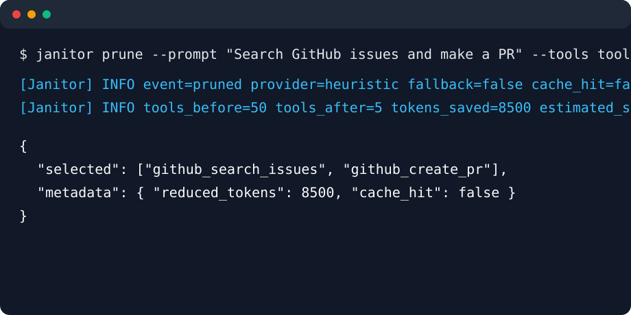
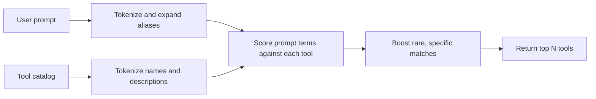

# Context Janitor

**100.0% tool-selection accuracy on the bundled synthetic benchmark at 0 ms median latency, with zero router cost.**



Context Janitor is a dependency-free CLI and Python library for pruning oversized LLM tool
catalogs. Give it a user prompt and a JSON list of tools, and it returns only the tools the agent
is likely to need.

It is built for agent systems where sending every available tool is expensive, slow, and noisy.
If an API-backed router fails, times out, or is missing credentials, Context Janitor can fall back
to a local heuristic so the pipeline keeps moving.

Context Janitor is MCP-compatible by design. MCP servers expose structured tool definitions, and
Context Janitor can sit between those JSON tool catalogs and your agent runtime. It is not an MCP
server itself in this release.

## Why It Exists

Large tool catalogs make agents worse in two ways:

- They inflate every request with thousands of extra prompt tokens.
- They increase the chance that the model picks a plausible but wrong tool.

Context Janitor keeps the tool surface small before the main model sees it.

| Setup | Tools sent | Tool overhead | Expected effect |
| --- | ---: | ---: | --- |
| Without Janitor | 50 | High | More prompt cost and more tool confusion |
| With Janitor | 5 | Low | Smaller payloads and clearer tool choice |

## Benchmark Snapshot

Run locally:

```powershell
python scripts\benchmark.py --providers heuristic
```

Current output on the included 100-prompt synthetic benchmark and `examples/tools.json`:

```text
+-----------------------+--------------------+---------------+-----------+--------+-----------------+------------------+-------------+--------------------------------------------------------------------------------------------------------------------------------------------+
| Mode                  | Selection accuracy | Agent success | Median ms | p95 ms | Router cost/run | Tool payload/run | Compression | Notes                                                                                                                                      |
+-----------------------+--------------------+---------------+-----------+--------+-----------------+------------------+-------------+--------------------------------------------------------------------------------------------------------------------------------------------+
| No Janitor (baseline) | 100.0%             | not measured  | 0         | 0      | $0.000000       | $0.001060        | 0.0%        | all 8 tools sent for 100 prompts |
| heuristic             | 100.0%             | not measured  | 0         | 0      | $0.000000       | $0.000260        | 75.4%       | ok |
+-----------------------+--------------------+---------------+-----------+--------+-----------------+------------------+-------------+--------------------------------------------------------------------------------------------------------------------------------------------+
```

Benchmark notes:

- `Selection accuracy` means the expected tool was present in the pruned selection.
- `No Janitor (baseline)` has 100% selection accuracy because every tool is sent.
- `Agent success` is intentionally `not measured` unless you provide real agent eval data.
- `Tool payload/run` uses `--payload-price-per-million`, which defaults to `$5.00`.
- `Router cost/run` uses `--router-price-per-million`, which defaults to `$0.15`.
- The included benchmark is a small synthetic sanity check. Run it against your own catalog before
  making production claims.

To display measured agent success rates:

```powershell
python scripts\benchmark.py --providers heuristic --agent-success-file examples\agent_success.example.json
```

## Installation

From a local checkout:

```powershell
pip install -e .
```

With test dependencies:

```powershell
pip install -e ".[test]"
```

With contributor tooling:

```powershell
pip install -e ".[dev]"
```

The package exposes two console scripts:

- `janitor`
- `context-janitor`

Most examples use the shorter `janitor` command.

## Quick Start

```powershell
janitor prune --prompt "Search GitHub issues and make a PR" --tools examples\tools.json --limit 2
```

Output:

```json
{
  "selected": [
    {
      "name": "github_search_issues",
      "description": "Search issues in a GitHub repository by text, label, state, or assignee."
    },
    {
      "name": "github_create_pr",
      "description": "Open a pull request with a title, body, source branch, and target branch."
    }
  ],
  "metadata": {
    "requested_provider": "heuristic",
    "provider": "heuristic",
    "fallback_used": false,
    "cache_hit": false,
    "duration_ms": 0,
    "limit": 2,
    "available_tools": 8,
    "original_tokens": 212,
    "selected_tokens": 60,
    "reduced_tokens": 152,
    "estimated_savings_usd": 0.00076
  }
}
```

Names-only output:

```powershell
janitor prune --prompt "Search GitHub issues and make a PR" --tools examples\tools.json --limit 2 --format names
```

```text
github_search_issues
github_create_pr
```

## Middleware Mode

`middleware` reads an OpenAI-compatible request JSON from stdin, prunes the `tools` field, and
writes the modified payload to stdout.

```powershell
Get-Content request.json | janitor middleware --limit 5
```

Input shape:

```json
{
  "messages": [
    { "role": "user", "content": "Create a calendar event" }
  ],
  "tools": [
    {
      "type": "function",
      "function": {
        "name": "calendar_create",
        "description": "Create events."
      }
    },
    {
      "type": "function",
      "function": {
        "name": "web_search",
        "description": "Search the web."
      }
    }
  ]
}
```

Logs go to stderr, so stdout remains safe to pipe into another command.

## Supported Tool Formats

Plain tool objects:

```json
[
  {
    "name": "github_create_pr",
    "description": "Open a pull request."
  }
]
```

OpenAI-style function tools:

```json
[
  {
    "type": "function",
    "function": {
      "name": "github_create_pr",
      "description": "Open a pull request.",
      "parameters": {
        "type": "object"
      }
    }
  }
]
```

Object wrappers are also accepted:

```json
{
  "tools": [
    { "name": "web_search", "description": "Search the web." }
  ]
}
```

## Selection Providers

Context Janitor supports four provider values:

| Provider | Uses network | Required environment |
| --- | --- | --- |
| `heuristic` | No | None |
| `openai` | Yes | `OPENAI_API_KEY` |
| `anthropic` | Yes | `ANTHROPIC_API_KEY` |
| `gemini` | Yes | `GEMINI_API_KEY` or `GOOGLE_API_KEY` |

Provider calls use only the Python standard library and default to an 800 ms timeout.

Example with OpenAI:

```powershell
$env:OPENAI_API_KEY = "..."
janitor prune `
  --provider openai `
  --model gpt-4o-mini `
  --prompt "Summarize this PDF" `
  --tools tools.json `
  --timeout-ms 800 `
  --fallback heuristic `
  --log-level INFO
```

If the provider errors, rate-limits, times out, or is missing credentials, `--fallback heuristic`
logs a warning and returns a heuristic selection instead of crashing the pipeline.

Set `--fallback none` if you want provider failures to exit with an error.

## How The Heuristic Works

The local selector is not just a keyword set. It is a compact TF-IDF-style ranker:

- Tokenizes the prompt and each tool's `name + description`
- Splits names like `github_search_issues` into useful terms
- Removes common stop words
- Expands common intent aliases like `meeting -> calendar event`
- Scores term frequency in the tool text
- Weighs rare terms more heavily with inverse document frequency
- Adds a small bonus for longer substring matches



Distinctive terms like `stripe`, `github`, `postgres`, or `pdf` usually beat generic words like
`create`, `get`, or `send`.

## Configuration

Context Janitor searches upward from the current directory for `.janitor.yaml`.

Example:

```yaml
provider: anthropic
model: claude-3-haiku-20240307
limit: 5
fallback: heuristic
cache: true
timeout_ms: 800
log_level: INFO
format: json
price_per_million_tokens: 5.0
keep: log_error,notify_admin
```

The config parser intentionally supports a simple flat `key: value` format. It is enough for the
settings above, but it is not a full YAML implementation.

CLI flags override config values.

| Key | Default | Description |
| --- | --- | --- |
| `provider` | `heuristic` | Selection backend: `heuristic`, `openai`, `anthropic`, or `gemini` |
| `model` | `null` | Model name for API-backed providers |
| `limit` | `5` | Maximum number of tools to keep |
| `fallback` | `heuristic` | Use `heuristic` or `none` after provider failure |
| `cache` | `false` | Reuse previous selections from local cache |
| `timeout_ms` | `800` | Provider timeout in milliseconds |
| `log_level` | `WARNING` | `DEBUG`, `INFO`, `WARNING`, `ERROR`, or `CRITICAL` |
| `format` | `json` | `prune` output format: `json`, `names`, or `raw` |
| `price_per_million_tokens` | `5.0` | Price used for savings estimates |
| `keep` | empty | Comma-separated tool names that must stay selected |

## Required Tools

Some production agents need safety, audit, or notification tools in every request. Use `--keep`
to force those tools into the selected set:

```powershell
janitor prune --prompt "Search the web" --tools tools.json --limit 5 --keep log_error,notify_admin
```

Kept tools reserve slots inside the limit. If `--limit 5` and you keep two tools, Janitor ranks
the catalog for the remaining three slots.

Selections modified by `keep` are not written into the normal semantic cache, because required
tools are policy rather than prompt relevance.

## Cache

Enable prompt caching:

```powershell
janitor prune --cache --prompt "Summarize the daily logs" --tools tools.json
```

Cache file:

```text
~/.janitor_cache/cache.json
```

The cache stores selections by prompt, provider, model, limit, and catalog hash. It can also reuse
highly similar prompts. If the cache cannot be read or written, Janitor ignores the cache and keeps
running.

Clear the local cache while iterating on prompts or tool descriptions:

```powershell
janitor clear-cache
```

## Explain Mode

Use `--explain` to see why tools were kept or pruned.

```powershell
janitor prune --prompt "Search GitHub issues" --tools examples\tools.json --limit 2 --explain
```

JSON output includes an `explain` array:

```json
{
  "name": "github_search_issues",
  "selected": true,
  "score": 14.0026,
  "matched_terms": ["github", "issues", "search"],
  "top_terms": ["issues", "search", "github", "substring_match"]
}
```

For `--format names` or `--format raw`, explanations are printed to stderr.

## Dry Run Mode

Use `--dry-run` with `middleware` to audition Janitor without changing the request payload:

```powershell
Get-Content request.json | janitor middleware --limit 5 --dry-run --log-level INFO
```

The original JSON is written back to stdout. Janitor logs what it would have kept and pruned to
stderr.

## CLI Reference

### `janitor prune`

Select tools for a prompt and a tool catalog.

```text
janitor prune --prompt PROMPT --tools tools.json [options]
```

Options:

| Option | Description |
| --- | --- |
| `--prompt TEXT` | User prompt. If omitted, stdin is used |
| `--tools PATH` | Required path to a JSON tool catalog |
| `--limit N` | Maximum tools to keep |
| `--provider NAME` | `heuristic`, `openai`, `anthropic`, or `gemini` |
| `--model NAME` | Model for API-backed providers |
| `--fallback NAME` | `heuristic` or `none` |
| `--timeout-ms N` | Provider timeout |
| `--cache` / `--no-cache` | Enable or disable local cache |
| `--log-level LEVEL` | Structured stderr logging level |
| `--price-per-million-tokens N` | Cost estimate price |
| `--keep a,b` | Required tools to keep |
| `--explain` | Include or print ranking explanations |
| `--format json` | Default structured output |
| `--format names` | Print selected tool names |
| `--format raw` | Print original selected tool objects |
| `--config PATH` | Explicit config file path |

### `janitor middleware`

Read a request payload from stdin and prune its `tools` field.

```text
janitor middleware [options] < request.json
```

Most options match `prune`. `middleware` also supports `--dry-run`.

### `janitor lint`

Validate a tool catalog and report quality warnings before using it in production:

```text
janitor lint --tools tools.json
```

The linter checks the catalog shape, duplicate names, empty descriptions, and very short
descriptions.

### `janitor clear-cache`

Delete the local semantic-selection cache:

```text
janitor clear-cache
```

## Python API

Synchronous API:

```python
from context_janitor.models import load_tools
from context_janitor.selection import select_resilient

tools = load_tools(tool_json)
result = select_resilient(
    provider="openai",
    model="gpt-4o-mini",
    prompt="Find GitHub issues about auth",
    tools=tools,
    limit=5,
    fallback="heuristic",
    timeout_ms=800,
    cache_enabled=True,
    keep=("log_error", "notify_admin"),
)

selected_tools = result.selected
```

Async wrapper:

```python
from context_janitor.selection import select_resilient_async

result = await select_resilient_async(
    provider="heuristic",
    prompt="Create a calendar event",
    tools=tools,
    limit=3,
)
```

`select_resilient_async` runs the same implementation in a worker thread. The current provider
clients use the Python standard library rather than native async HTTP.

## Structured Logging And ROI

Use `--log-level INFO` to emit production-friendly logs to stderr:

```text
[Janitor] INFO event=pruned requested_provider=openai provider=heuristic fallback=true cache_hit=false tools_before=50 tools_after=5 tokens_before=12000 tokens_after=1200 tokens_saved=10800 estimated_savings_usd=0.054000 duration_ms=7
```

Token counts use a lightweight estimate of roughly four characters per token. Savings are useful
for quick comparisons, not invoice-grade accounting.

## Benchmarks

Run the included benchmark:

```powershell
python scripts\benchmark.py --providers heuristic openai anthropic gemini --openai-model gpt-4o-mini --anthropic-model claude-3-haiku-20240307 --gemini-model gemini-1.5-flash
```

Useful benchmark options:

| Option | Default | Description |
| --- | --- | --- |
| `--providers` | `heuristic` | Providers to compare |
| `--limit` | `5` | Tools kept per prompt |
| `--timeout-ms` | `800` | Provider timeout |
| `--router-price-per-million` | `0.15` | Router model input price estimate |
| `--payload-price-per-million` | `5.0` | Main model tool payload price estimate |
| `--agent-success-file` | none | JSON map of measured agent success rates |

Model pricing moves quickly, so treat the defaults as placeholders and set these values to your
current provider prices when calculating ROI.

Example agent success file:

```json
{
  "baseline": 0.85,
  "heuristic": 0.99
}
```

The benchmark skips API providers when their API keys are missing.

## Real Prompt Evals

Use `scripts/evaluate.py` to check Janitor against prompts from your own product instead of the
bundled synthetic benchmark:

```powershell
python scripts\evaluate.py --tools examples\tools.json --evals examples\evals.example.json --providers heuristic --limit 2
```

To report the production-facing `Distraction Delta`, pass measured agent success rates:

```powershell
python scripts\evaluate.py --tools examples\tools.json --evals examples\evals.example.json --providers heuristic --limit 2 --agent-success-file examples\agent_success.example.json
```

`Distraction Delta` is `Success_with_Janitor - Success_baseline`, which helps separate "the right
tool was present" from "the agent actually completed the task more often."

Eval files may be JSON or JSONL. Each case needs a `prompt` and one of `expected_tool`,
`expected_tools`, or `expected`:

```json
[
  {
    "id": "github-triage",
    "prompt": "Find open GitHub issues about billing and summarize the blockers.",
    "expected_tool": "github_search_issues"
  }
]
```

For production rollout, replace `examples/evals.example.json` with real tasks from your agent logs
and track the resulting accuracy alongside downstream agent success.

## Recipes

- [LangChain / LangGraph](recipes/langchain-langgraph.md)
- [CrewAI](recipes/crewai.md)
- [Vercel AI SDK](recipes/vercel-ai-sdk.md)
- [GitHub Actions](recipes/github-actions.md)

## Terminal GIF

The repository includes a VHS tape at [docs/demo.tape](docs/demo.tape).

Render it with VHS:

```powershell
vhs docs/demo.tape
```

On Windows, ScreenToGif is also a practical option for recording the terminal benchmark.

## Development

Set up:

```powershell
pip install -e ".[dev]"
```

Run tests:

```powershell
python -m pytest
```

Run lint and type checks:

```powershell
python -m ruff check .
python -m mypy src scripts
```

Validate package metadata:

```powershell
python -c "import tomllib; tomllib.load(open('pyproject.toml','rb')); print('pyproject ok')"
```

Run the benchmark:

```powershell
python scripts\benchmark.py --providers heuristic
```

## Release Checklist

- Confirm `version = "0.1.0"` in [pyproject.toml](pyproject.toml).
- Create a matching GitHub release tag, for example `v0.1.0`.
- Run the tests and benchmark.
- Render or update the terminal GIF.
- Verify the README examples still match CLI output.

## Project Status

Context Janitor is early alpha software. The heuristic path is dependency-free and tested. API
provider routing, prompt caching, and integration recipes are ready for real-world feedback, but
you should benchmark against your own tool catalog before production rollout.
